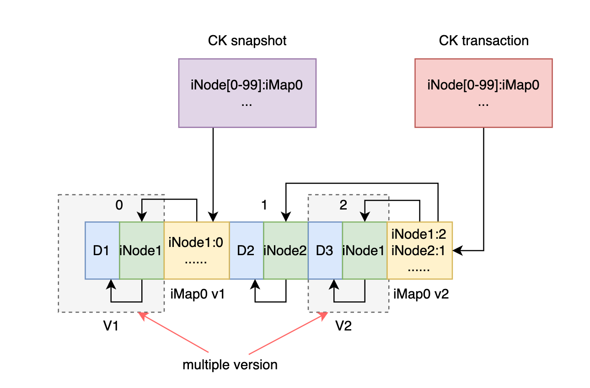
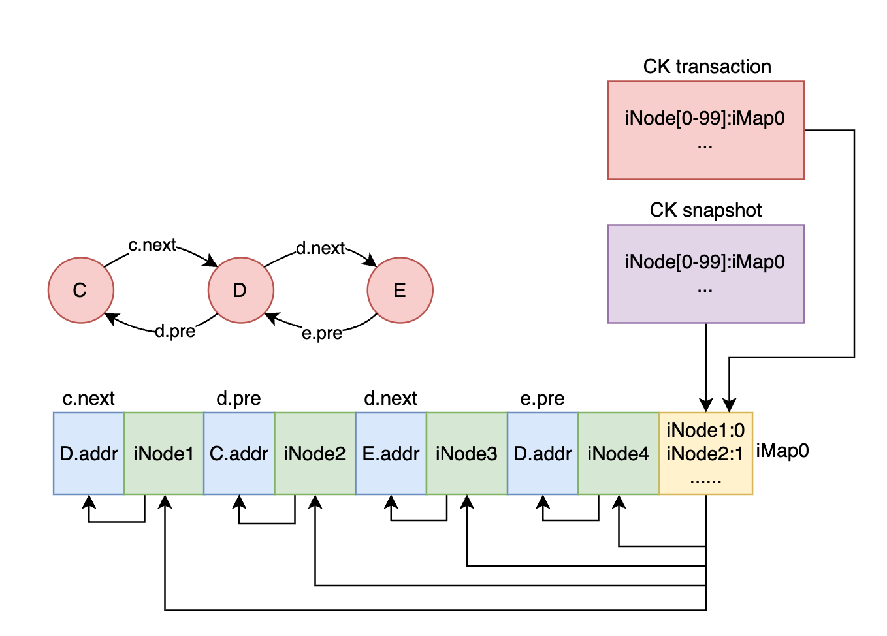
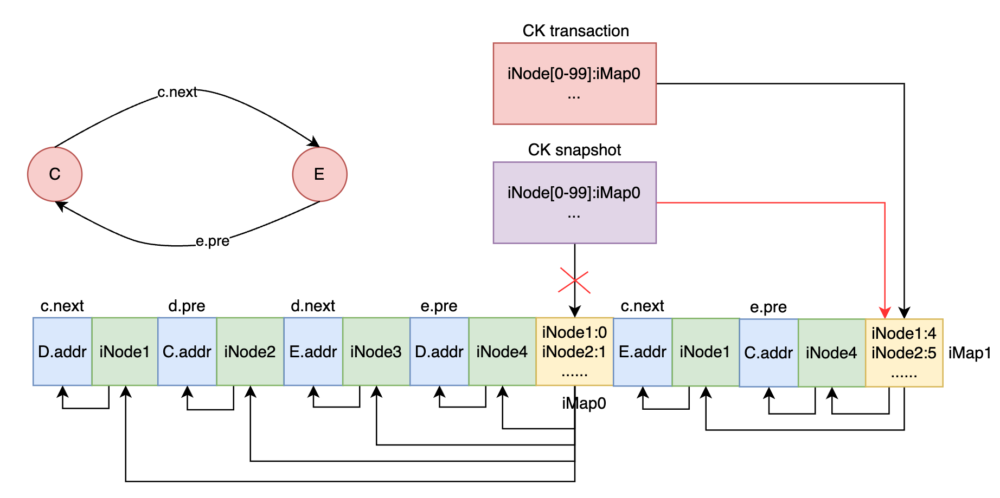
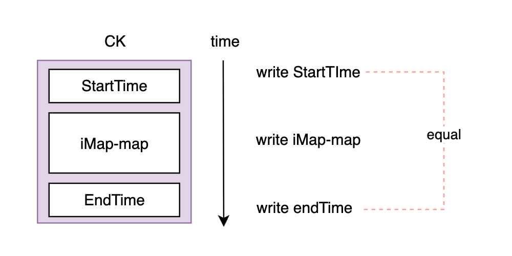
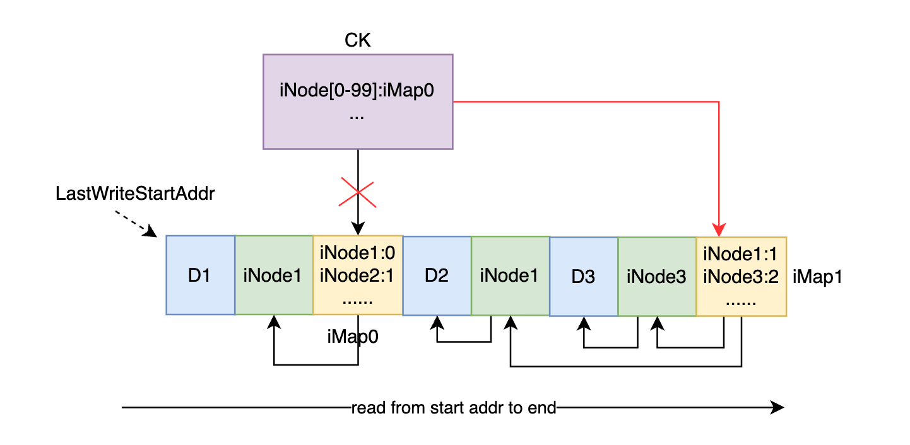
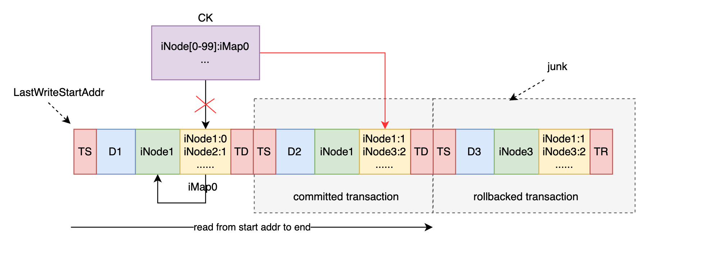

# Dolphin存储引擎

## 特点

* 数据以日志方式存储，写入高效；

* 支持基于快照的事务写入，保证写入的原子性；

## 存储简介

存储引擎中的数据被切分为多个chunk以日志方式追加到文件中，每个chunk最大容量为4096字节，且每个chunk都被一个iNode引用。

一个iNode可以引用4个chunk和1个iNode，被引用的iNode还可以引用4个chunk和1个iNode，所以理论上通过iNode的一层层引用可以使得存储引擎能够存储任意大小的数据。

存储引擎中会为存入其中的每条数据分配一个唯一的id即数据id，根据这个id可以找到数据的根iNode，进而可以根据iNode的引用关系找到组成数据的所有chunk；

**数据的存入**

存储引擎将要存入的数据分割为多个chunk，分配iNode指向各个chunk，随后分配一个数据id来指向根iNode，最后返回这个id作为数据的引用。

**数据读取**

数据读取需要提供数据id、读取开始位置和要读取的大小，存储引擎根据id找到根iNode，然后根据读入的开始位置和读入大小找到目标数据所在的chunk并读取其中的数据返回。

**数据修改**

与读取类似，数据修改也需要提供修改的位置和大小来告诉存储引擎要修改的数据的区域，除此之外还需要提供新的数据来替换前面标记的数据；存储引擎会创建新的chunk和iNode追加到日志中，旧的chunk和iNode不会立即被删除。

**数据删除**

只要数据id到根iNode的引用被删除了就可以认为数据已经被删除了。

## 日志结构

为了达到较高的写入性能，数据的新增、修改和删除都是以追加的方式记录在日志中。

**新增**

新增数据以chunk、iNode的顺序写入。

**修改**

修改会在日志中写入变化的chunk和iNode。如下图中chunk D1被D3替换，在日志结尾写入了新的chunk D3和iNode1。

以追加的方式写入导致iNode和chunk的位置不固定，在读取时如何找到数据的iNode需要额外的结构。可以为iNode分配一个id，并通过一个叫做iMap的结构将id映射为iNode的地址，在读取iNode时先要从iMap查找iNode的地址。

**iMap的更新**

每次更新完一个数据都要更新iMap，为了达到较好的性能我们将iMap也写入到日志中。

如上图所示，每次写入数据后都会在最后写入新的iMap；然而这种方式又带来新的问题

* iMap可能很大（数据越多iNode越多，需要更大的iMap来存储映射关系）
* iMap在文件中有多个版本，我们应该怎样找到最新版本的iMap

解决方案：

对于第一个问题，我们可以将iMap切割成很多小块，每次只往日志中写入引用到要修改的iNode相关的iMap。这样就能不用担心iMap过大的问题了。

问题一的方案又带来了另一个问题，即怎么确定iNode在哪块iMap中。我们可以通过再加一张表来存储iNode id与iMap地址的映射关系来做到，如果将这张表的位置固定在文件的某处那么问题二也就得到了解决。我们将这张新增的表和一些其他的数据存储在一个固定的叫检查点（CK）的位置。

在增加了新的数据结构CK后我们还需要做一件事情，在日志中写入iMap后更新检查点。为了提高性能，更新方式可以是先更新内存中的检查点缓存，稍后再刷入CK到文件中以提高性能，不过这种方式可能会在崩溃后丢失部分的修改，后面介绍的崩溃恢复能够解决这个问题。

## 事务控制

假设我们在存储引擎中存储一个双向链表，现在要删除链表的节点D，删除过程可以通过三个步骤完成。如果在第一步完成后出现崩溃，存储引擎中的链表将不再是一个有效的链表结构；

1. C的next指针指向E
2. E的previous指针指向C
3. 删除数据D

这里的链表节点删除就是一个典型的需要保证原子性的操作，应用程序（引擎的调用方）可以通过其他方式来保证原子性，不过这里引擎可以通过事务的方式保证多个操作的原子性，这使得应用的工作更简单。

只需要在操作前启动事务，操作后提交事务就可以保证上述操作的原子性：

1. 启动事务
2. C的next指针指向E
3. E的previous指针指向C
4. 删除数据D
5. 提交事务

在事务启动后提交前的这段时间内，事务外观察不到事务对数据的修改。在这个例子中体现在删除操作的事务未提交前，事务外的所有读操作读到的链表都是包含D节点的链表。

**多版本数据**

存储引擎中所有对数据的修改都是增量的，引擎对数据的修改实质上是通过放弃数据老版本的引用而将数据的指针指向新数据块实现的，数据的老版本在被垃圾回收前一直保留在系统中，此时系统中存在一个数据的多个版本。

如果事务开始后有多个数据发生了修改（系统中会存在多个数据的多个版本），我们在事务提交后一次性地更新这些数据的引用到新的版本，就算事务期间发生崩溃，因为数据指针还没有切换所以数据还是事务前的版本，即原子性。同样由于事务期间指针未切换，事务外无法读取到事务内的修改，即隔离性。

还有一点需要考虑的是事务的可读性，在事务内能够读取到事务对数据的修改。可以在事务创建时为整个存储引擎文件创建一个快照，事务对数据的修改不会影响到快照，在事务外看来数据还是原来的样子，事务自身又能够读取到它对数据的修改。

**存储引擎快照**

因为数据的访问是从检查点（CK）查询iNode所在的iMap开始的，如果我们只给CK创建快照就能保证通过CK快照访问的数据是事务前的版本。

事务内的修改就不能再更新快照检查点了，我们给事务分配一个专属于当前事务的检查点（事务CK），事务CK的指针总是指向当前事务修改的最新的iMap，而这个iMap又会指向事务内修改的最新的iNode，iNode又指向最新的数据chunk，这样在事务内通过事务CK访问到的数据就是事务内修改的数据。

用前面的删除双向链表中的节点操作举例。

如下图，在事务刚开始时，快照CK与事务CK同时指向iMap0，此时存储的数据结构对应于图中的链表。

接下来看删除D节点到事务提交前文件中发生了什么：C节点的next指针指向E（体现在c.next数据块记录的是E的地址），E节点的previous指针指向C（体现在e.pre数据块记录的是C的地址），事务CK指向iMap1。如图所示，事务CK于快照CK指向了不同的iMap，他们各自读取各自的数据版本。

**事务提交**

事务提交后其他读操作都能够观察到事务的修改（除了正在进行中的事务外），完成提交只需要将事务CK合并到快照CK中，如果合并没有冲突那么快照CK最终指向的iMap就是事务CK指向的iMap。体现在链表示例中就是D节点已从链表中被删除。

**多事务冲突**

如果在事务提交时的前一刻另一个事务合并了CK，当前事务合并会使CK指向新的iMap，导致前一个事务的修改被覆盖。出于实现简单的考虑，存储引擎在同一时刻只允许一个写入事务处于开启状态。

## 崩溃一致性

**写入chunk或iNode时发生崩溃**

若在写入chunk或iNode时放生崩溃，由于iMap中iNode的指针还是指向的老版本的iNode，故iNode与chunk写入时的崩溃对数据的一致性没有影响。

**写入iMap发生崩溃**

若在写入iMap时放生崩溃，由于最新的iMap引用还没有写入到检查点，故检查点引用的还是旧版本的iMap，也不会影响一致性。

**更新检查点发生崩溃**

若在更新检查点时发生崩溃，会导致检查点自身不一致，崩溃恢复后从检查点读取iMap的地址得到的结果是不可预期的，所以需要额外的措施来处理检查点更新崩溃的情况。

我们将CK分为三部分，开始时间（Start Time）、iMap表、结束时间；在更新CK时它们按顺序依次写入，其中StartTime与EndTime的值相同，都为写入开始时的时间戳。如果CK写入过程没有发生崩溃，读取CK时StartTime与EndTime应该一致。（这里用CRC类似的校验机制也可以达到完整性校验的目的，用时间戳来校验的好处在下面会有说明）

假如读取到CK中的StartTime与EndTime不一致，即上一次CK更新过程中发生了崩溃，此时CK的内容已成为无效数据，这时根据CK来访问存储的数据必然会得到令人意外的结果。毫不意外我们还需要额外的措施来保证CK更新崩溃后还能读取到正确的数据。

我们可以备份CK，在CK被破坏后我们读取备份来继续访问数据，这会是个有效的措施。具体流程是：在载入文件时读取StartTime最新的那个CK，如果该CK无效继续去读取StartTime更旧的那个CK，由于第二个CK是第一个的备份，所以不管怎样都能读取到一个有效的CK。

这里又引入一个问题，更新CK时该更新哪个CK，我们看看写入不同的CK会产生什么影响。先假设两个CK（CK1和CK2）中的时间戳一致，正在使用的CK是CK1，

1. 若前n次更新成功，在第n+1次更新时放生了崩溃，下次载入CK时载入的是另一个完整的CK（即CK2），通过CK2读取数据时会发现前n次的写入都丢失了。

2. 若前n次更新成功，在第n+1次更新时放生了崩溃，下次载入CK时载入的是另一个完整的CK（即CK1），通过CK1读取数据时会发现前n次的写入都丢失了。（与情况1相同）

上面的列出的两种情况都会出现丢失前n次更新数据的问题，有没有办法只丢失崩溃放生时的那次写入。我们试试一次更新两个CK，两个CK的更新顺序又有两种情况。

1. 先更新CK1再更新CK2。若前n次都更新成功，在第n+1次时更新CK1失败，下载载入时载入CK2。由于在第n次更新时已经更新了CK2，所以读取到的数据是包含前n次修改的。若在第n+1次时CK1更新成功，CK2更新时发生崩溃，下载载入时载入CK1，则第n+1次修改依然得到了保留。
2. 先更新CK2再更新CK1的情况与第一种情况一样。

看上去先更新CK1或CK2都能够达到同样的效果，但是我们选择先更新CK2在更新CK1。原因是CK2可能是不一致的CK，如果在更新CK1时发生崩溃，那么系统CK1和CK2都是无效的CK，下次载入再也找不到一个有效的CK了。

**事务提交前发生崩溃**

事务使用的自己的事务检查点，在事务提交前快照检查点没有不会更新，所以事务提交前发生崩溃就跟事务没有启动一样。

**事务提交时发生崩溃**

事务提交时会更新快照检查点（无特别说明快照检查点就是前文描述的检查点），与更新检查点时崩溃情况一致，已在前文描述。

## 崩溃恢复

崩溃一致性使得我们的数据结构不会因为崩溃而破坏，崩溃恢复的目的是使数据恢复到上次崩溃前的一致性版本。

由于检查点被缓存在内存中，若缓存以每30s的间隔被刷入到磁盘，若刷入时发生崩溃，下次重新载入检查点就会发现丢失了30s的数据。数据并没有真正丢失，但是检查点已丢失导致无法再访问这部分数据，如果我们能够重建检查点，我们就能够找回这些丢失的数据。

从崩溃中恢复的首要问题是知道从何处开始恢复，我们可以在检查点中记录日志最后一次写入的地址，这样我们就有了一个恢复起点。

有了起点后我们需要从起点开始读取所有的日志，从这些日志中读出iMap，用iMap更新检查点。

如果事务提交前发生崩溃，在恢复时如果将事务中对iMap的修改更新到检查点会导致事务的原子性被破坏。所以我们在恢复的过程中还需要确定事务已经提交，我们可以在日志头部加上事务开始标记TS，在事务结束位置写入事务提交TD或者事务回滚标记TR。只有在TS与TD间的数据才能被恢复。

## 垃圾收集

那些不再被引用的iNode、chunk和iMap就变成了垃圾，如果不将它们占用的空间回收最终日志文件将占满整个磁盘的可用空间。

如果我们将垃圾数据从日志文件中删除会让日志中存在很多空洞。复用这些空洞会使得新写入的日志不能被连续写入从而丧失了日志结构的优势。

解决方法是将活的块复制到日志尾部并更新元数据，旧数据块所占用的空间在下次写入时覆盖掉。我们还需要一个头指针(log Start)标记哪个位置之前的块为脏块和一个尾指针（logEnd）来标记下一次日志写入的位置。这样日志文件就变成了下图中的模样，垃圾收集器从logSart开始读取数据块，将存活的数据写入到日志尾部。

由于磁盘的写入带宽存在上限，如果垃圾收集的写入占用太多磁盘带宽肯定会影响用户数据写入，所以我们希望垃圾收集的效率尽可能的高一些以让垃圾收集对用户的写入影响最小。最理想的情况就是读取的n块中n块都是垃圾，通常情况下存储的数据不会全是垃圾，而是一部分比较活跃的数据加一部分比较长久的数据，我们可以对它们进行分组。

我们可以将整个数据文件分为多个段（segment），一些段存储生命较长的数据而另一些段存储生命较短的数据。在清理时更频繁的清理短生命的段，更少的清理长生命的段。当短生命的段中的数据存活达到一个周期数后将它们存入到长生命段中。清理后的段被称为空段，清理的过程就是将存活的数据从段中复制到一个空段中。被清理过的段变成了空段，可以继续写入数据。

数据文件被分为多个段后写入也需要做一些调整，当我们写满一个段后需要跳到下一个空段继续写入，垃圾收集的时候同样需要知道将段中的存活的数据复制到哪个段中。我们将空段首位相连，再将写满数据的段首位相连，这样就得到了两条链。写入时往空段链写入，当写满一个段时将这个段从空段链移除并连接到满数据段中。当垃圾清理时将存活的数据从段中复制到空段链中，空出来的空段连接到空段链中。我们在检查点中用图表示这种段间的连接关系。
