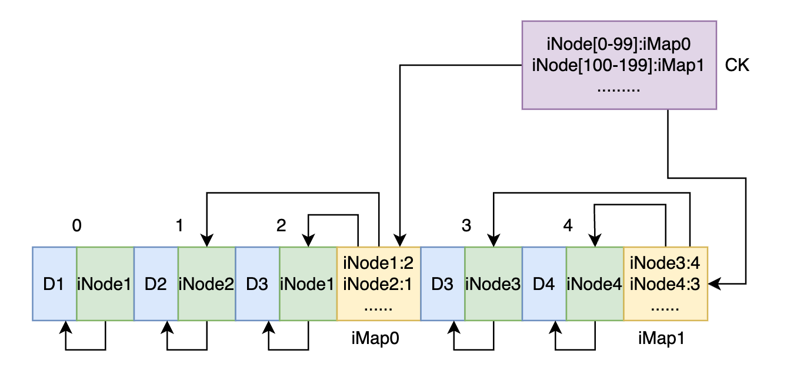
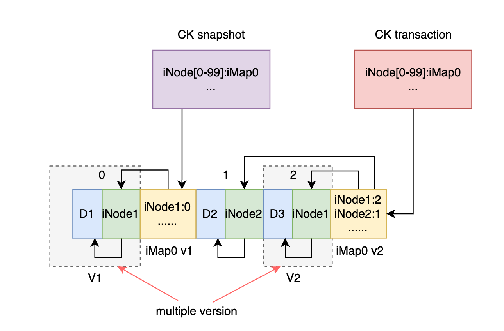

# Dolphin存储引擎

## 特点

* 数据以日志方式存储，写入的高效；

* 支持基于快照的事务写入，保证写入的原子性；

## 存储简介

存储引擎中的数据被切分为多个chunk以日志方式追加到文件中，每个chunk最大容量为4096字节，且每个chunk都被一个iNode引用。

一个iNode可以引用4个chunk和1个iNode，被引用的iNode还可以引用4个chunk和1个iNode，所以理论上通过iNode的一层层引用可以使得存储引擎能够存储任意大小的数据。

存储引擎中会为存入其中的每条数据分配一个唯一的id即数据id，根据这个id可以找到数据的根iNode，进而可以根据iNode的引用关系找到组成数据的所有chunk；

**数据的存入**

存储引擎将要存入的数据分割为多个chunk，分配iNode指向各个chunk，随后分配一个数据id来指向根iNode，最后返回这个id作为数据的引用。

**数据读取**

数据读取需要提供数据id、读取开始位置和要读取的大小，存储引擎根据id找到根iNode，然后根据读入的开始位置和读入大小找到目标数据所在的chunk并读取其中的数据返回。

**数据修改**

与读取类似，数据修改也需要提供修改的位置和大小来告诉存储引擎要修改的数据的区域，除此之外还需要提供新的数据来替换前面标记的数据；存储引擎会创建新的chunk和iNode追加到日志中，旧的chunk和iNode不会立即被删除。

**数据删除**

只要数据id到根iNode的引用被删除了就可以认为数据已经被删除了。

## 日志结构

为了达到较高的写入性能，数据的新增、修改和删除都是以追加的方式记录在日志中。

**新增**

新增数据以chunk、iNode的顺序写入。

**修改**

修改会在日志中写入变化的chunk和iNode。如下图中chunk D1被D3替换，在日志结尾写入了新的chunk D3和iNode1。

以追加的方式写入导致iNode和chunk的位置不固定，在读取时如何找到数据的iNode需要额外的结构。可以为iNode分配一个id，并通过一个叫做iMap的结构将id映射为iNode的地址，在读取iNode时先要从iMap查找iNode的地址。

**iMap的更新**

每次更新完一个数据都要更新iMap，为了达到较好的性能我们将iMap也写入到日志中。

如上图所示，每次写入数据后都会在最后写入新的iMap；然而这种方式又带来新的问题

* iMap可能很大（数据越多iNode越多，需要更大的iMap来存储映射关系）
* iMap在文件中有多个版本，我们应该怎样找到最新版本的iMap

解决方案：

对于第一个问题，我们可以将iMap切割成很多小块，每次只往日志中写入引用到要修改的iNode相关的iMap。这样就能不用担心iMap过大的问题了。

问题一的方案又带来了另一个问题，即怎么确定iNode在哪块iMap中。我们可以通过再加一张表来存储iNode id与iMap地址的映射关系来做到，如果将这张表的位置固定在文件的某处那么问题二也就得到了解决。我们将这张新增的表和一些其他的数据存储在一个固定的叫检查点（CK）的位置。

在增加了新的数据结构CK后我们还需要做一件事情，在日志中写入iMap后更新检查点。为了提高性能，更新方式可以是先更新内存中的检查点缓存，稍后再刷入CK到文件中以提高性能，不过这种方式可能会在崩溃后丢失部分的修改，后面介绍的崩溃恢复能够解决这个问题。

## 事务控制

假设我们在存储引擎中存储一个双向链表，现在要删除链表的节点D，删除过程可以通过三个步骤完成。如果在第一步完成后出现崩溃，存储引擎中的链表将不再是一个有效的链表结构；

1. C的next指针指向E
2. E的previous指针指向C
3. 删除数据D

这里的链表节点删除就是一个典型的需要保证原子性的操作，应用程序（引擎的调用方）可以通过其他方式来保证原子性，不过这里引擎可以通过事务的方式保证多个操作的原子性，这使得应用的工作更简单。

只需要在操作前启动事务，操作后提交事务就可以保证上述操作的原子性：

1. 启动事务
2. C的next指针指向E
3. E的previous指针指向C
4. 删除数据D
5. 提交事务

在事务启动后提交前的这段时间内，事务外观察不到事务对数据的修改。在这个例子中体现在删除操作的事务未提交前，事务外的所有读操作读到的链表都是包含D节点的链表。

**多版本数据**

存储引擎中所有对数据的修改都是增量的，引擎对数据的修改实质上是通过放弃数据老版本的引用而将数据的指针指向新数据块实现的，数据的老版本在被垃圾回收前一直保留在系统中，此时系统中存在一个数据的多个版本。

假设事务开始后有多个数据发生了修改（系统中会存在多个数据的多个版本），在事务提交后一次性地更新这些数据的引用到新的版本。如果事务期间发生崩溃，因为数据指针还没有切换所以数据还是事务前的版本，即原子性。同样由于事务期间指针未切换，事务外无法读取到事务内的修改，即隔离性。

还有一点需要考虑的是事务的可读性，在事务内能够读取到事务对数据的修改。可以在事务创建时为整个文件创建一个快照，事务对数据的修改不会影响到快照，在事务外看来数据还是原来的样子，事务自身又能够读取到它对数据的修改。

**存储引擎快照**

因为数据的访问是从检查点（CK）查询iNode所在的iMap开始的，如果我们只给CK创建快照就能保证通过CK快照访问的数据是事务前的版本。我们给事务分配一个专属于当前事务的检查点（事务CK），事务CK的指针总是指向当前事务修改的最新的iMap，而这个iMap又会指向事务内修改的最新的iNode，iNode又指向最新的数据chunk，这样在事务内通过事务CK访问到的数据就是事务内修改的数据。

## 崩溃一致性

在写入数据过程的任何时刻都有可能发生崩溃，崩溃不应该导致存储的不一致。

崩溃发生点：

## 崩溃恢复

## 垃圾收集

